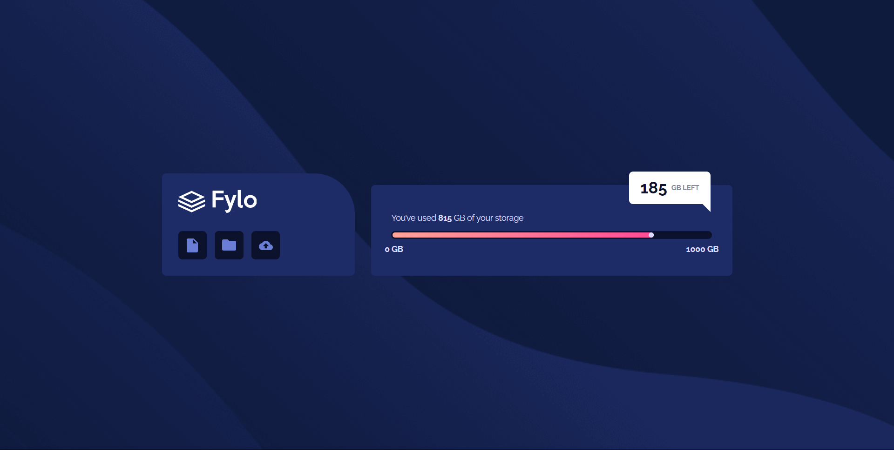
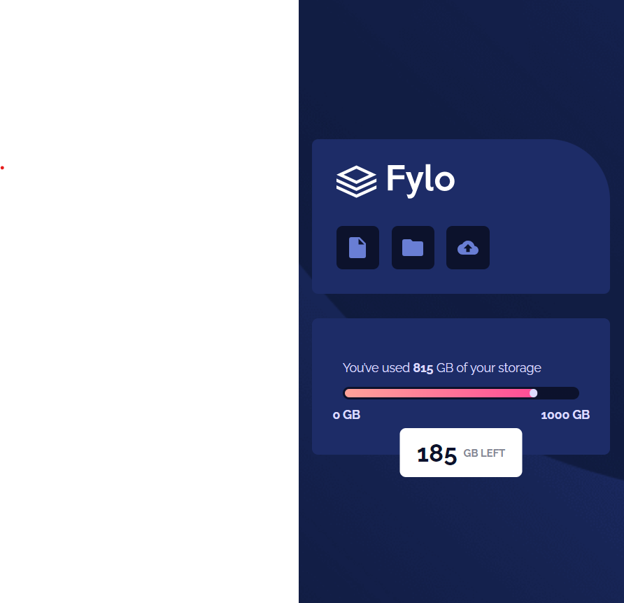

# Frontend Mentor - Fylo Data Storage Component

## Welcome! 👋

This is a solution to the [Fylo Data Storage Component challenge on Frontend Mentor](https://www.frontendmentor.io/challenges/fylo-data-storage-component-1dZPRbV5n/hub). 
Frontend Mentor challenges help you improve your coding skills by building realistic projects. 

## The challenge

The challenge is to build out this design and get it looking as close to the design as possible.

You can use any tools you like to help you complete the challenge. So if you've got something you'd like to practice, feel free to give it a go.

Your users should:

- View the optimal layout for the site depending on their device's screen size

### Screenshot

### Links

- Solution URL: https://github.com/gudhi987/Fylo-Data-Storage-Component
- Live Site URL: https://fylo-data-storage-component-jagadeesh.netlify.app/

## My process

### Built with

- Semantic HTML5 markup
- CSS custom properties
- Flexbox
- CSS Grid
- Mobile-first workflow
- [Styled Components](https://styled-components.com/) - For styles
- Media queries
- CSS Position
- CSS Color Gradients

### What I learned

During the time of building this project, I revised the basic html tags and css styles and 
become more familiar with css-grid, css-flexbox, media queries and others.

### Resources

You can find resources in assets and design folders.